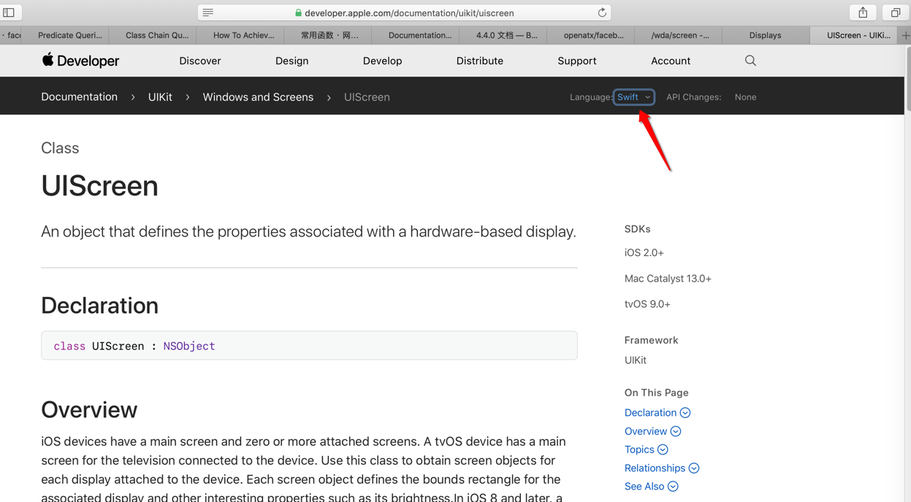
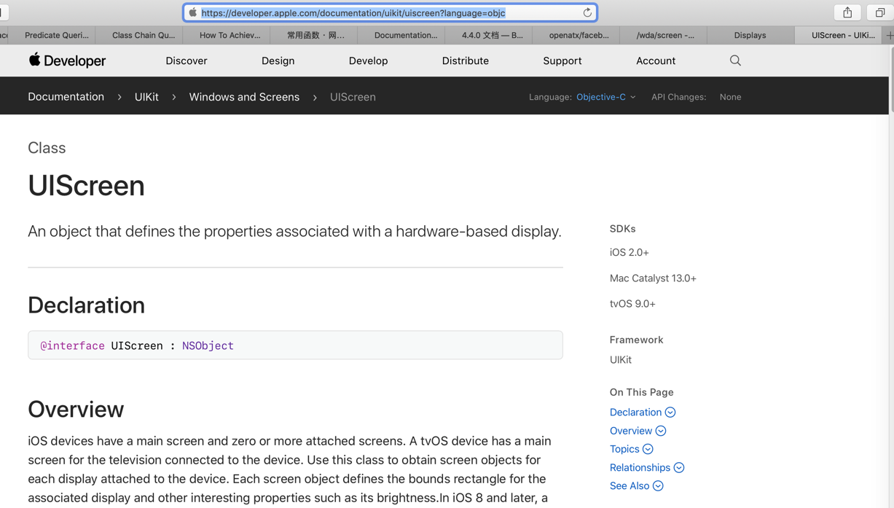

# 文档

此处整理出有用的苹果相关开发文档，供需要时查阅。

## iOS 旧文档

* 举例
  * [Displays - iOS Device Compatibility Reference](https://developer.apple.com/library/archive/documentation/DeviceInformation/Reference/iOSDeviceCompatibility/Displays/Displays.html)

## iOS 新文档
统一后的 = 新的
* 举例
  * [UIScreen - UIKit | Apple Developer Documentation](https://developer.apple.com/documentation/uikit/uiscreen)
* 且还分2种语言
  * `Swift`
    * https://developer.apple.com/documentation/uikit/uiscreen
      * 截图
        * 
  * `Objective-C`
    * https://developer.apple.com/documentation/uikit/uiscreen?language=objc
      * 截图
        * 
* 说明
  * 其中内容大体类似，主要是语法不同
    * 不过有时候细节也不太一样
* 举例
    * `Objective-C`中`UIDeviceBatteryState`中，找不到枚举值的常量值定义

[UIDeviceBatteryState - UIKit | Apple Developer Documentation](https://developer.apple.com/documentation/uikit/uidevicebatterystate?language=objc)

```bash
typedef enum UIDeviceBatteryState : NSInteger {
    ...
} UIDeviceBatteryState;
```

* Constants
  * UIDeviceBatteryStateUnknown
    * The battery state for the device cannot be determined.
  * UIDeviceBatteryStateUnplugged
    * The device is not plugged into power; the battery is discharging.
  * UIDeviceBatteryStateCharging
    * The device is plugged into power and the battery is less than 100% charged.
  * UIDeviceBatteryStateFull
    * The device is plugged into power and the battery is 100% charged.

-》想要知道对应的枚举值定义的int值

-》

[UIDeviceBatteryStateUnknown - UIDeviceBatteryState | Apple Developer Documentation](https://developer.apple.com/documentation/uikit/uidevicebatterystate/uidevicebatterystateunknown?language=objc)

> The battery state for the device cannot be determined.
> 
>   UIDeviceBatteryStateUnknown

-》没看到定义的值

-》无意间发现，换Swift语言后：

[UIDevice.BatteryState - UIDevice | Apple Developer Documentation](https://developer.apple.com/documentation/uikit/uidevice/batterystate)

-》点击具体的某个定义，都可以看到具体常量枚举值定义：

* case unknown
  * The battery state for the device cannot be determined.
    * UIDevice.BatteryState.unknown - UIDevice.BatteryState | Apple Developer Documentation
    * https://developer.apple.com/documentation/uikit/uidevice/batterystate/unknown
    * case unknown = 0
* case unplugged
  * The device is not plugged into power; the battery is discharging.
    * UIDevice.BatteryState.unplugged - UIDevice.BatteryState | Apple Developer Documentation
    * https://developer.apple.com/documentation/uikit/uidevice/batterystate/unplugged
    * case unplugged = 1
* case charging
  * The device is plugged into power and the battery is less than 100% charged.
    * UIDevice.BatteryState.charging - UIDevice.BatteryState | Apple Developer Documentation
    * https://developer.apple.com/documentation/uikit/uidevice/batterystate/charging
    * case charging = 2
* case full
  * The device is plugged into power and the battery is 100% charged.
    * UIDevice.BatteryState.full - UIDevice.BatteryState | Apple Developer Documentation
    * https://developer.apple.com/documentation/uikit/uidevice/batterystate/full
    * case full = 3 

-》总结来说：

此处是`ObjC`中看不到`UIDeviceBatteryState`的细节的枚举值的定义

而换成`Swift`的`UIDevice.BatteryState`，就可以看到具体的枚举的定义的常量的值了

