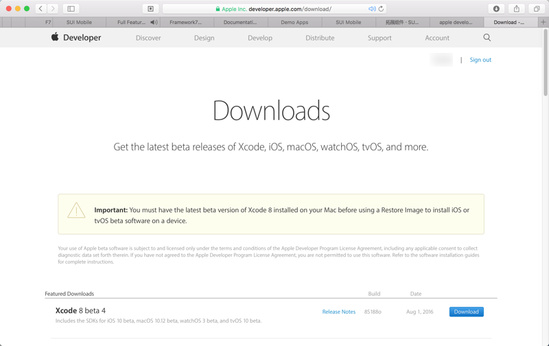
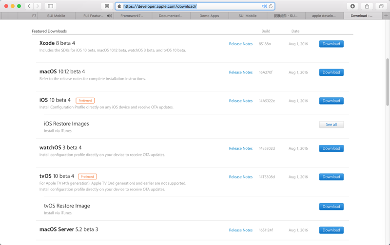
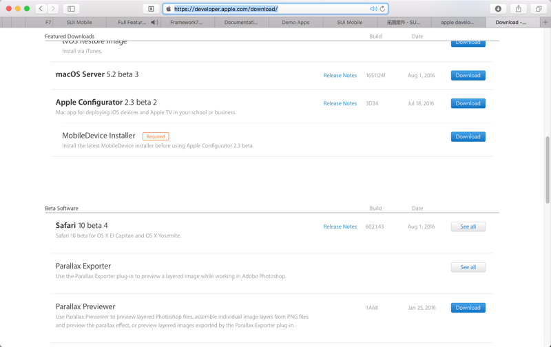

# 苹果开发者账号

做苹果的iOS方面的开发，前提是需要有个`苹果开发者账号`，一般也被称为`Apple ID`=`苹果开发者ID`

这个账号是需要购买的，最便宜的个人版，一年也要**99美元**的。

有了这个苹果开发者账号后，才可以发布app。

而同时，也会享有一些额外的好处。

## 提前使用新版本

注册了苹果开发者账号后，可以有机会在苹果正式发布Xcode，iOS等最新版本之前，可以去下载试用beta版本

Apple Developer Center特殊待遇：可以先下载一些beta的开发环境

登录

[Apple Developer Center](https://developer.apple.com/download/)

之后，就可以看到里面有很多在正式发布之前的供开发者内测的beta版的iOS，Xcode等资源：

