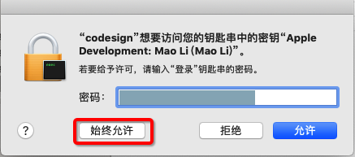

# security

举例：

```bash
security unlock-keychain -p xxx ~/Library/Keychains/login.keychain-db
```

## 暂时无效，有待后续深入研究

之前用：

```bash
# 解锁keychain，以便可以正常的签名应用，
PASSWORD="replace-with-your-password"
security unlock-keychain -p $PASSWORD ~/Library/Keychains/login.keychain-db
# 获取设备的UDID
CUR_UDID=$(idevice_id -l | head -n1)
# 运行测试
xcodebuild -project WebDriverAgent.xcodeproj -scheme WebDriverAgentRunner -destination "id=$CUR_UDID" test
```

实现自动化测试，结果却还会弹框让输入密码：



-》说明之前的：`security unlock-keychain` 并没有起效果

-》具体原因，有待深究。
