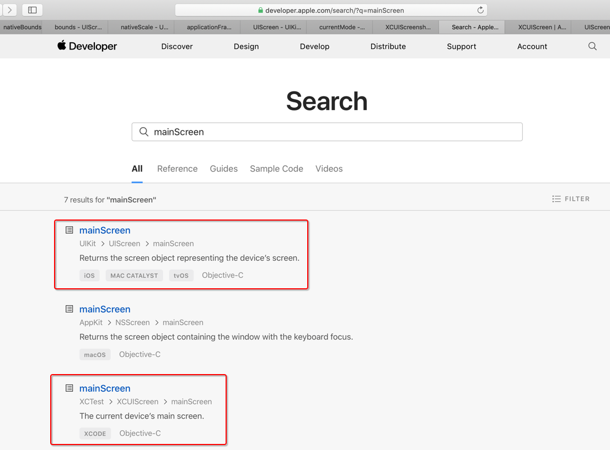
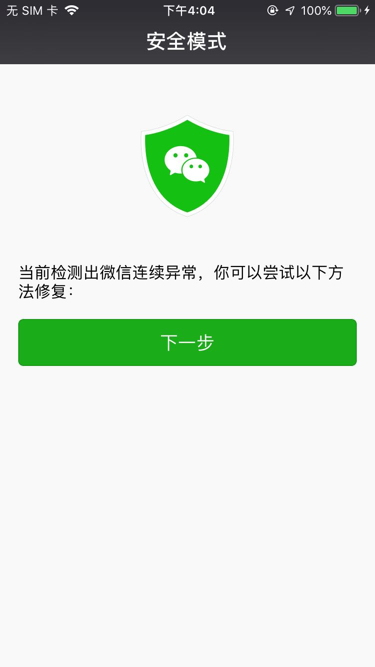
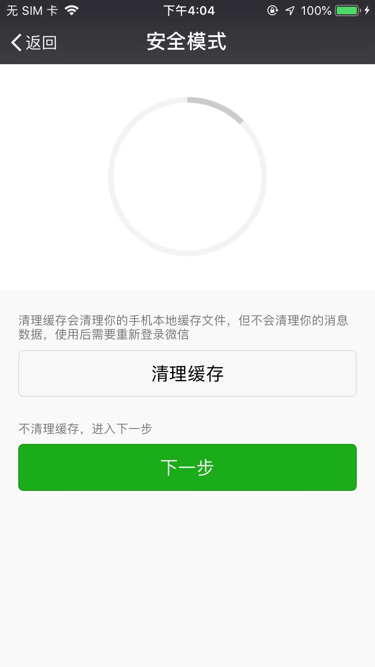
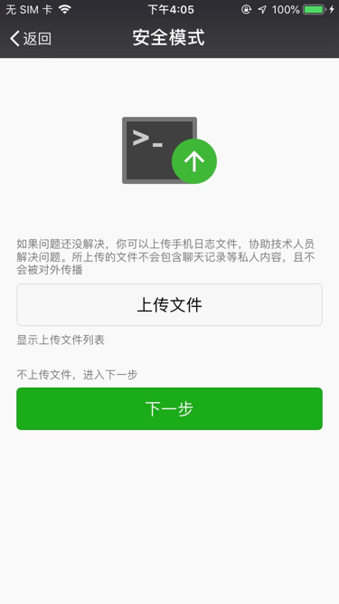
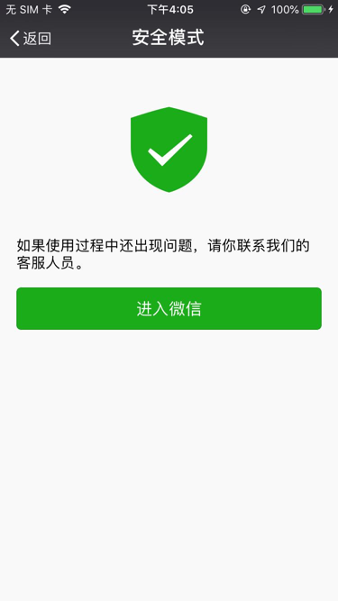
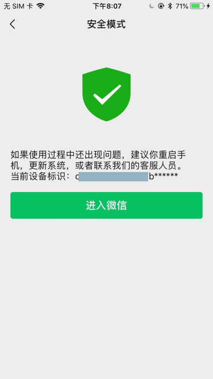

# iOS

## iOS自动化

详见完整教程：

[移动端自动化测试概览](https://book.crifan.com/books/mobile_automation_overview/website/)

中的

[iOS自动化测试利器：facebook-wda](https://book.crifan.com/books/ios_automation_facebook_wda/website/)

## XCTest

* iOS最新测试框架是：`XCTest`
  * 别称：`XCUITest`

下面列出一些常用的部分：

* 用户界面
    * [User Interface Tests | Apple Developer Documentation](https://developer.apple.com/documentation/xctest/user_interface_tests?language=objc)
        * 其中常用的部分是：
          * `XCUIScreen`
              * A physical screen attached to a device
          * `XCUIScreenshot`
              * A captured image of a screen, app, or UI element state.
          * `XCUIDevice`
              * Simulates physical buttons, device orientation, and Siri interaction for an iOS device.
          * `XCUISiriService`
              * Simulates a device’s Siri interface.
          * `XCUIRemote`
              * Simulates interaction with a physical remote control.

关于具体细节如下：

* 设备
  * [XCUIDevice - XCTest | Apple Developer Documentation](https://developer.apple.com/documentation/xctest/xcuidevice?language=objc)
    * sharedDevice
      * The current device.
* 远程
  * [XCUIRemote - XCTest | Apple Developer Documentation](https://developer.apple.com/documentation/xctest/xcuiremote?language=objc)
    * `pressButton`:
      * Sends a momentary press of a button on a physical remote control.

## 一些心得

### 找接口和函数时，可以充分利用官网自带的搜索

比如想要找哪些类中有mainScreen，可以搜：

[mainScreen](https://developer.apple.com/search/?q=mainScreen)

https://developer.apple.com/search/?q=mainScreen



可以看到我们希望找的有2处：

* `mainScreen`
    * `UIKit` -> `UIScreen` -> `mainScreen`
        * Returns the screen object representing the device’s screen.
* `mainScreen`
    * `XCTest` -> `XCUIScreen` -> `mainScreen`
        * The current device’s main screen.

### 官网文档分语言的 -》 Swift和Objective-C 接口略有不同的

* XCUIScreen
    * Swift
        * XCUIScreen - XCTest | Apple Developer Documentation
            * https://developer.apple.com/documentation/xctest/xcuiscreen
    * Objective-C
        * XCUIScreen - XCTest | Apple Developer Documentation
            * https://developer.apple.com/documentation/xctest/xcuiscreen?language=objc

不过，总体上内容是一致的：

* mainScreen
    * The current device’s main screen.
* screens
    * The current device’s active screens.

只不过Swift和OC的写法不太一样而已。

注：之前见过个别函数和接口好像功能上略有不同。

目前没找到。等找到了。再补充。

总之：注意看文档时所选择的语言，是Swift还是ObjC，不要搞错就好。

### 测试Screen相关内容：XCUIScreen和UIScreen

* XCUIScreen
    * 文档
        * XCUIScreen - XCTest | Apple Developer Documentation
            * https://developer.apple.com/documentation/xctest/xcuiscreen?language=objc
* UIScreen
    * 文档
        * UIScreen - UIKit | Apple Developer Documentation
            * https://developer.apple.com/documentation/uikit/uiscreen?language=objc


之所以要注意此处有2个Screen的原因是：

之前想要找，除了scale之外的bounds属性，最后发现：XCUIScreen是没有的

所以代码：

```cpp
return [XCUIScreen.mainScreen nativeScale];
return [XCUIScreen.mainScreen bounds];
return [XCUIScreen.mainScreen nativeBounds];
```

会报错。要改为：

```cpp
return [UIScreen.mainScreen nativeScale];
return [UIScreen.mainScreen bounds];
return [UIScreen.mainScreen nativeBounds];
```
才可以。

## 微信

### 连续多次崩溃会进入安全模式

iOS中微信如果检测到连续崩溃了多次后，会进入**安全模式**：










然后才会恢复正常微信界面。

后来，换了iPhone 6P，多次调试期间，虽然微信没怎么崩溃，但是也遇到类似的问题：



如果要用代码自动化操作实现上述步骤，则可以参考：

[安全模式 · iOS自动化测试利器：facebook-wda](https://book.crifan.com/books/ios_automation_facebook_wda/website/common_code/app/weixin/safe_mode.html)
