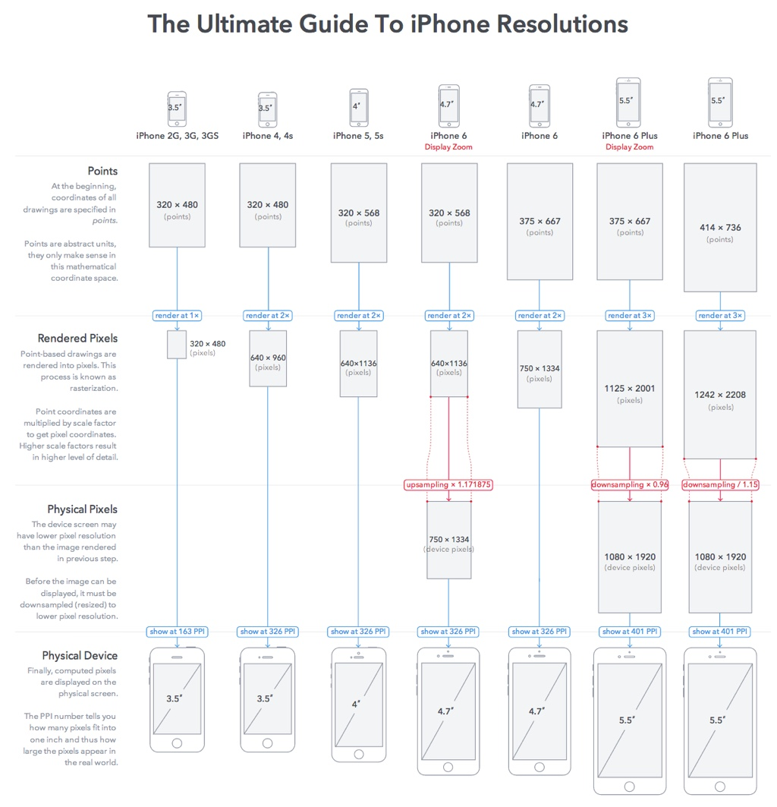
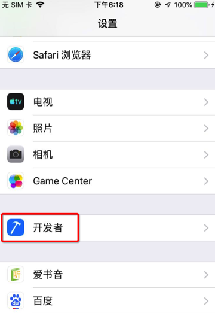
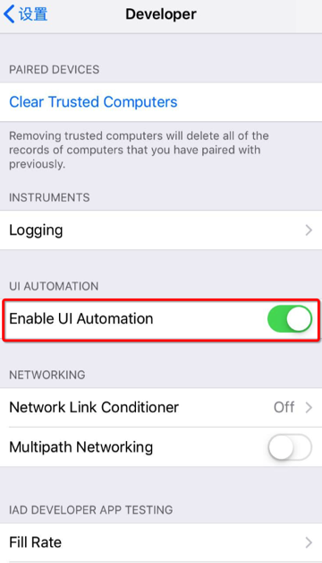
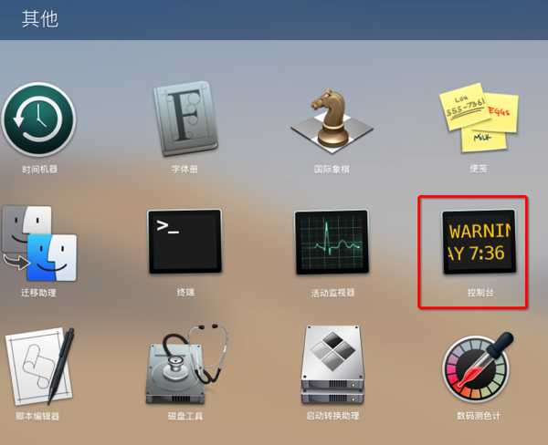
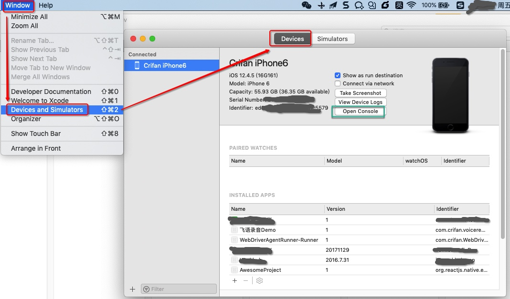
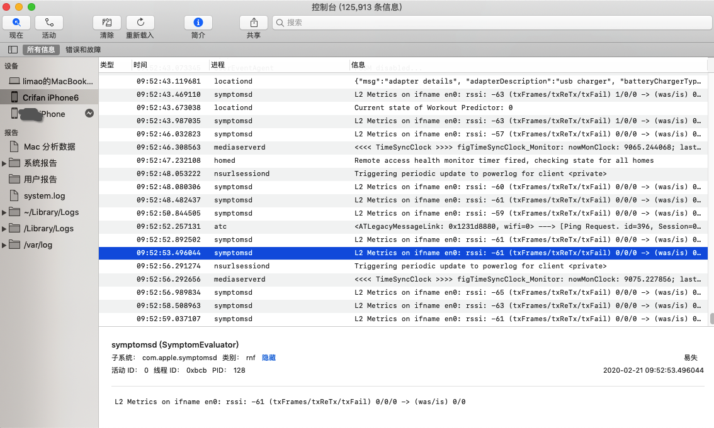
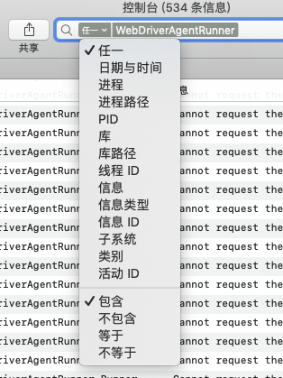
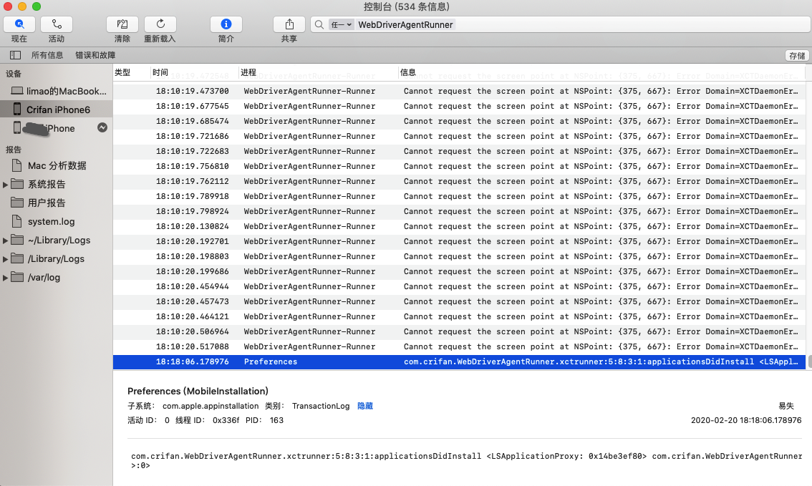

# iPhone

TODO：

* 【已解决】已越狱iPhone的iOS中如何命令行创建一个大文件
* 【记录】iPhone手机恢复还原出厂设置
* 【已解决】iPhone中查看ARM版本：armv6、armv7
* 
* 设备识别
  * 【已解决】iPhone插入Mac后提示：可能不支持此配件
  * 【已解决】Mac无法识别插入的已越狱iPhone7
* 状态栏
  * 【已解决】iPhone中左上角状态栏中显示运营商的效果
  * 【已解决】iPhone顶部状态栏中图标和信息的具体含义
* app管理
  * 【已解决】Mac中如何获取到iPhone中自带应用设置的bundle ID
  * 【无法解决】越狱iPhone中把iOS的app移动到/Applications目录
* 卡贴机
  * 【已解决】iPhone卡贴机
  * 【整理】购买二手iPhone测试机
* 文件管理
  * 【已解决】已越狱iOS中如何通过ssh从iPhone拷贝出文件
* SSH
  * 【已解决】给已越狱iPhone6修改ssh密码并开启ssh免密登录
  * 【记录】给越狱iPhone7安装SSH并配置免密登录
  * 【已解决】ssh登录iPhone失败：Host key verification failed
* SSH证书
  * 【已解决】Mac中删除已有ssh证书和已安装到iPhone中的ssh证书

---

`iOS`开发期间，用到的最多的设备就是`iPhone`了，此处整理iPhone的相关开发心得。

## iPhone的类型和尺寸

苹果的移动端的设备，典型都有`iPhone`，`iPad`等，所用的操作系统都是iOS。

其中用的最多是`iPhone`。

`iPhone`的设备类型，相对较固定，数量有限。

下面总结一下，不同的iPhone设备的屏幕相关的参数：

| 机型 | 屏幕宽高/单位点 | 屏幕模式 | 屏幕对角线长度 |
| --- | ------------- | ------- | ----------- |
| iPhone 3GS | 320x480 | 1x | 3.5英寸 |
| iPhone 4 | 320x480 | 2x | 3.5英寸 |
| iPhone 5 | 320x568 | 2x | 4英寸 |
| iPhone 6 | 375x667 | 2x | 4.7英寸 |
| iPhone 6 Plus | 414×736 | 3x | 5.5英寸 |

对应的屏幕类型分辨率和像素的换算关系为：

## 开发相关设置

新版iPhone中的设置中有个`开发者`，有很多开发相关的设置。

其中和自动化测试有关的是：

`设置`->`开发者`->`Enable UI Automation`

对于后续自动化测试，或许有用。

## iPhone真机的log日志查看

可以通过 控制台 查看iPhone真机的Log日志

如何打开控制台：

* 启动台Launch Pad -> 其他 -> 控制台
  * 
* Xcode->Window->Devices and Simulators->Devices
  * 

启动后，即可看到iPhone真机的log日志了：

也支持条件过滤，比如：

任一 包含：`WebDriverAgentRunner`

## 关闭悬浮球

iOS自动化测试期间，记得要关闭：悬浮球

【已解决】iPhone中关闭全屏显示的悬浮球

否则有时候会误触发，影响自动化测试
